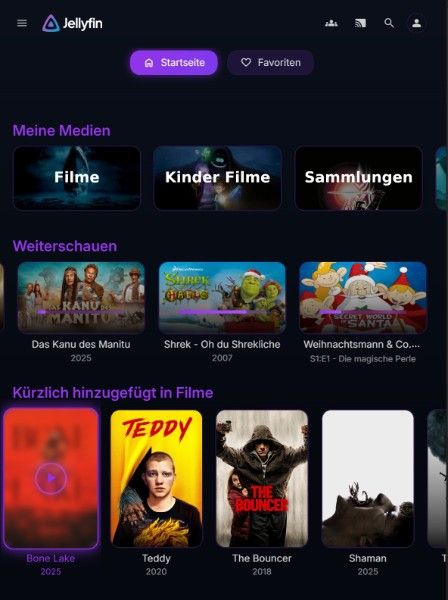
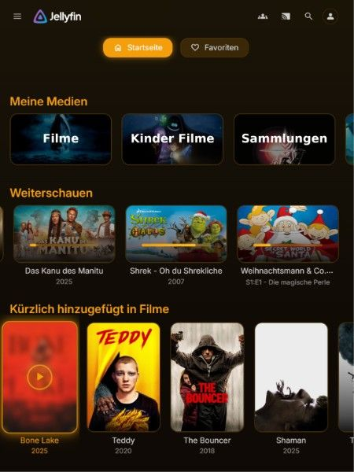
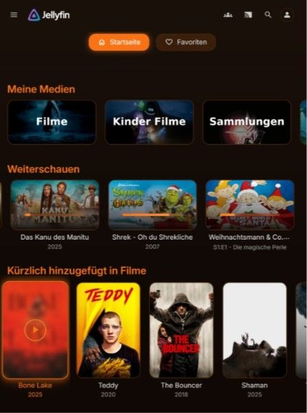
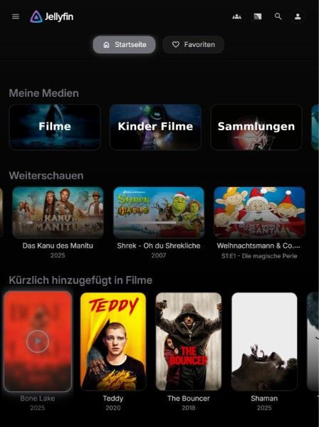
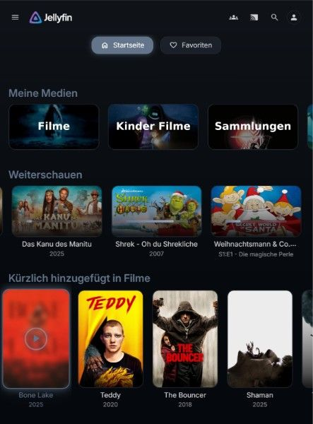

<div align="center">

# ✨ JellyThemes ✨

**Transform your Jellyfin into a cinematic experience**

*6 stunning dark themes. One click install. Pure elegance.*

[](https://github.com/kingchenc/JellyThemes/stargazers)
[](https://www.jsdelivr.com/package/gh/kingchenc/JellyThemes)
[](LICENSE)

</div>

---

## Themes

| Theme | Color | Description |
|-------|-------|-------------|
| [Obsidian](Themes/Obsidian/) | Purple/Violet | Deep space with elegant violet accents |
| [Solaris](Themes/Solaris/) | Gold/Amber | Warm golden sun tones |
| [Nebula](Themes/Nebula/) | Cyan/Cosmic | Cool cosmic cyan vibes |
| [Ember](Themes/Ember/) | Orange/Fire | Fiery orange warmth |
| [Void](Themes/Void/) | Gray/Minimal | Pure black minimalism |
| [Phantom](Themes/Phantom/) | Slate/Ghost | Ghostly translucent slate |

---

## Quick Install

Go to **Dashboard > General > Custom CSS** and paste one of these:

### 🟣 Obsidian (Purple)

```css
@import url("https://cdn.jsdelivr.net/gh/kingchenc/JellyThemes@master/Themes/Obsidian/Obsidian.css");
```

<details>
<summary>📸 Preview</summary>
<br>

</details>

---

### 🟡 Solaris (Gold)

```css
@import url("https://cdn.jsdelivr.net/gh/kingchenc/JellyThemes@master/Themes/Solaris/Solaris.css");
```

<details>
<summary>📸 Preview</summary>
<br>

</details>

---

### 🔵 Nebula (Cyan)

```css
@import url("https://cdn.jsdelivr.net/gh/kingchenc/JellyThemes@master/Themes/Nebula/Nebula.css");
```

<details>
<summary>📸 Preview</summary>
<br>

</details>

---

### 🟠 Ember (Orange)

```css
@import url("https://cdn.jsdelivr.net/gh/kingchenc/JellyThemes@master/Themes/Ember/Ember.css");
```

<details>
<summary>📸 Preview</summary>
<br>

</details>

---

### ⚫ Void (Black)

```css
@import url("https://cdn.jsdelivr.net/gh/kingchenc/JellyThemes@master/Themes/Void/Void.css");
```

<details>
<summary>📸 Preview</summary>
<br>

</details>

---

### 👻 Phantom (Slate)

```css
@import url("https://cdn.jsdelivr.net/gh/kingchenc/JellyThemes@master/Themes/Phantom/Phantom.css");
```

<details>
<summary>📸 Preview</summary>
<br>

</details>

---

## Features

- Modern dark design with customizable accent colors
- Glass-morphism effects with blur and transparency
- Smooth animations with cubic-bezier easing
- Glow effects on interactive elements
- Enhanced typography with Inter font
- Responsive design for desktop, mobile, and TV
- Custom scrollbars and progress bars
- Polished buttons with consistent hover states

## Compatibility

### Platforms
- Desktop (Windows, macOS, Linux)
- Mobile (iOS, Android)
- Smart TVs (WebOS, Tizen, Android TV, Fire TV)
- Gaming Consoles (Xbox, PlayStation)

### Browsers
- Chrome/Chromium
- Firefox
- Safari
- Edge

### Jellyfin Apps
- Jellyfin Web
- Jellyfin Media Player
- Jellyfin for Android/Android TV
- Jellyfin for iOS
- Swiftfin
- Any client that supports custom CSS

## Contributing

Contributions are welcome! Here's how you can help:

1. **Fork** the repository
2. **Create** a feature branch (`git checkout -b feature/awesome-feature`)
3. **Commit** your changes (`git commit -m 'Add awesome feature'`)
4. **Push** to the branch (`git push origin feature/awesome-feature`)
5. **Open** a Pull Request

### Guidelines
- Test your changes on multiple devices (desktop, mobile, TV)
- Follow the existing code style and variable naming conventions
- Update documentation if needed
- Keep pull requests focused on a single feature or fix

## Feedback

Found a bug? Have a feature request? We'd love to hear from you!

- **Issues**: [Open an issue](https://github.com/kingchenc/JellyThemes/issues)
- **Discussions**: [Start a discussion](https://github.com/kingchenc/JellyThemes/discussions)

## License

GPL-3.0 - See [LICENSE](LICENSE) for details.

## Star History

[](https://star-history.com/#kingchenc/JellyThemes&Date)

---

<div align="center">

Made with love for the Jellyfin community

</div>
